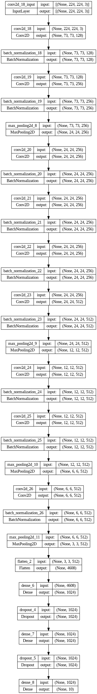

# Hand Gesture Recognition using Deep Learning

## Overview

This project implements a hand gesture recognition system using deep learning techniques with TensorFlow and Keras. It involves preprocessing a dataset from Kaggle, building and training a convolutional neural network (CNN) model, and evaluating its performance.

## Dataset

The dataset used in this project is the Leap Gesture Recognition dataset available on Kaggle. It consists of images of hand gestures captured under various conditions.

### Downloading the Dataset

To download the dataset in Google Colab, follow these steps:

```bash
# Install Kaggle API
!pip install kaggle

# Setup Kaggle credentials
!mkdir ~/.kaggle
!mv kaggle.json ~/.kaggle/
!chmod 600 ~/.kaggle/kaggle.json

# Download dataset
!kaggle datasets download gti-upm/leapgestrecog

# Unzip dataset
!unzip /content/leapgestrecog.zip
```
## Getting Started

### Installation
Make sure you have Python 3.x installed along with the following libraries:

```bash
!pip install numpy pandas tensorflow scikit-learn matplotlib seaborn opencv-python
```
### Usage
Data Preprocessing: Images are read, organized, and split into training, validation, and testing sets.

Model Building: A CNN model is constructed using Keras with several convolutional and pooling layers for feature extraction.

Training: The model is trained on the training set and validated on the validation set.

Evaluation: Model performance is evaluated using the testing set, and metrics such as accuracy and a confusion matrix are generated.

## Model Architecture


## Contributor
Subhangi Sati

